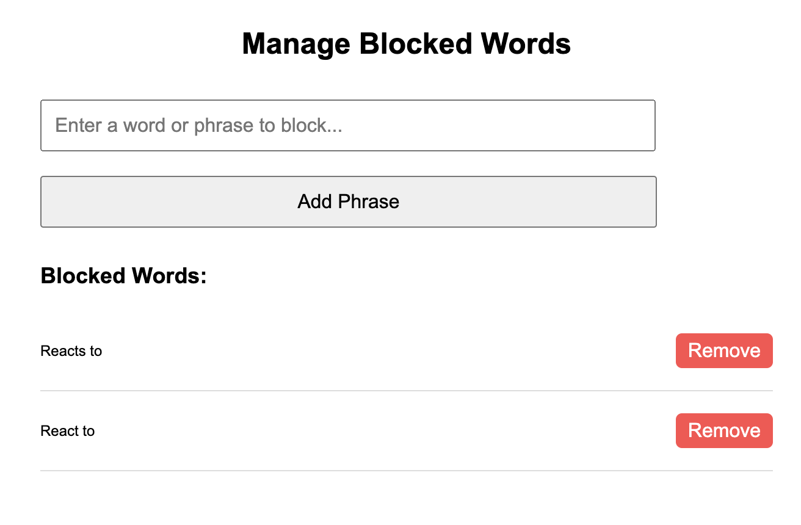

# YouTube Video Blocker

A simple Chrome extension that removes YouTube video suggestions containing specific phrases, such as "react to" or "reacts to". Users can manage blocked words or phrases through a clean UI.

---

## Features

- **Filter YouTube Suggestions**: Blocks video suggestions containing customizable words or phrases.
- **Dynamic Blocking**: Automatically handles new content loaded as you scroll.
- **User-Friendly Interface**: Add and manage blocked phrases via a dedicated settings page.
- **Customizable**: Adjust the filter list to suit your needs.

---

## Screenshots


*The Options page where you can add or remove blocked words.*

---

## Installation

1. Clone or download this repository.
2. Open `chrome://extensions/` in Chrome.
3. Enable **Developer Mode** in the top-right corner.
4. Click **Load unpacked** and select the folder containing this project.
5. The extension is now active. Manage filters via the Options page!

---

## Usage

1. **Adding a Blocked Phrase**:
   - Open the extension's options page from `chrome://extensions/` → Details → Extension Options.
   - Enter a phrase in the input box and click **Add Phrase**.

2. **Removing a Blocked Phrase**:
   - Click **Remove** next to the unwanted phrase in the list.

3. **Filter in Action**:
   - Navigate to YouTube. The extension will automatically hide videos matching any blocked phrases in your list.

4. **Logging**:
   - Open the console (`Ctrl+Shift+J` or `Cmd+Option+J`) to see a log of removed video titles.

---

## Development

### Folder Structure
```
.
├── manifest.json       # Chrome extension manifest
├── content.js          # Main content script
├── options.html        # Options page (UI for managing blocked phrases)
├── options.js          # JavaScript for options page
├── icon.png            # Extension icon
└── README.md           # Project documentation
```

### Running Locally
1. Clone the repository:
   ```bash
   git clone https://github.com/mhero/js-browser-yt-blocker.git
   cd js-browser-yt-blocker
   ```
2. Follow the [Installation](#installation) steps above to load the extension into Chrome.

---

## Contributions

Contributions, issues, and feature requests are welcome! Feel free to open a [pull request](https://github.com/mhero/js-browser-yt-blocker/pulls) or [issue](https://github.com/mhero/js-browser-yt-blocker/issues) in this repository.

---

## License

This project is licensed under the [MIT License](./LICENSE).

